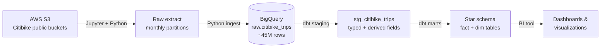
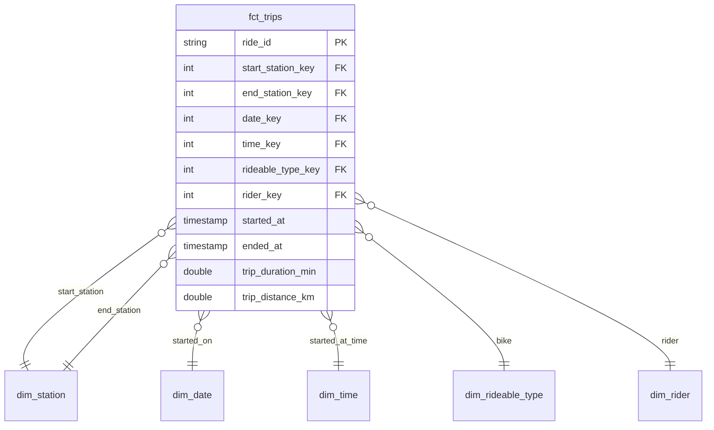

# Citibike Analytics Engineering Pipeline
 
An end-to-end analytics engineering project that ingests 12 months of rolling [Citibike](https://citibikenyc.com/system-data) trip data, lands it in a [Google BigQuery](https://motherduck.com/) warehouse, and transforms it with [dbt](https://www.getdbt.com/) into a star schema ready for analysis and visualization.
 
The goal of the project is to practice the full modern analytics engineering workflow — extraction, raw ingestion, staging, and dimensional modeling — on a real, reasonably large dataset (~45M rows).
 
---
 
## Architecture
 

 
## Tech Stack
 
| Layer | Tool |
|---|---|
| Extraction | Python, Jupyter Notebook, `boto3` / `s3fs` |
| Storage / Warehouse | Google BigQuery |
| Transformation | dbt |
| Modeling | Dimensional / star schema |
| Visualization | Prepped for Looker Studio and Power BI |
 
---
 
## Pipeline
 
### 1. Extract — Pull rolling Citibike data from S3
 
A Python script in a Jupyter notebook pulls a rolling 12 months of Citibike trip data from the public AWS S3 buckets. The data is published as zipped monthly CSV partitions, so the script enumerates the relevant partitions, downloads them, and unzips them locally for ingestion.
 
> Note: Citibike publishes its trip data in public S3 buckets. No AWS credentials are required to read public objects, but `boto3`/`s3fs` still need to be configured for unsigned/anonymous access.
 
### 2. Ingest — Land raw data in Google BigQuery
 
The extracted partitions are loaded into a single raw table in BigQuery directly from Python. Alongside the trip columns, the ingest captures **partition metadata** (e.g. location (NYC vs JC) and the year/month the partition represents) so that lineage back to the original file is preserved.
 
The result is one consolidated raw table of roughly **45M rows**:
 
```
raw.citibike_trips
```

> Note: **This is intentionally not a production-grade ingestion
pattern** — at scale, the right approach is loading CSVs directly from S3
or GCS into BigQuery using the native load API, which parses and ingests
server-side without holding data in local memory.  
>
> The pandas-based approach was chosen here to demonstrate:
> - Working with the AWS S3 API via `boto3`
> - Streaming and unpacking zipped CSVs in memory
> - Filtering and shaping data with `pandas`
> - Authenticating to and writing data into BigQuery via a service account
 
### 3. Stage — Type and clean with dbt
 
`dbt init` scaffolds a dbt project connected to the BigQuery raw table. A staging model reads from `raw.citi_bike_trips` and:
 
- Casts every column to an explicit, well-defined data type
- Standardizes / renames fields into a consistent naming convention
- Adds **derived fields** (e.g. trip duration, day of week, hour of day, ride distance)
- Filters out obviously invalid records (negative durations, null stations, test rides, etc.)
```
models/staging/stg_citibike_trips.sql
```
 
### 4. Model — Build the star schema
 
The staging model feeds a set of fact and dimension tables, producing a star schema optimized for analytical queries and BI.
 
```
models/marts/
├── fct_trips.sql          # grain: one row per trip
├── dim_station.sql        # start/end station attributes
├── dim_date.sql           # calendar dimension
├── dim_time.sql           # time-of-day dimension
├── dim_rideable_type.sql  # classic vs. electric bike
└── dim_rider.sql          # member vs. casual
```
 
**`fct_trips`** holds the measures (trip duration, distance) and foreign keys out to each dimension. The dimensions conform around it so trips can be sliced by station, calendar date, time of day, bike type, and rider type.
 
---
 
## Data Model
 

 
---
 
## Project Structure
 
```
.
├── notebooks/
│   └── extract_ingest.ipynb     # S3 pull + MotherDuck ingest
├── citibike_dbt/                # dbt project
│   ├── models/
│   │   ├── staging/
│   │   └── marts/
│   ├── dbt_project.yml
│   └── profiles.yml             # (gitignored)
├── requirements.txt
└── README.md
```
 
---
 
## Getting Started
 
### Prerequisites
 
- Python 3.10+
- A BigQuery project setup and key file generated
- dbt with the BigQuery adapter


 
## Notes & Future Work
 
- Add dbt tests (uniqueness, not-null, relationships) and source freshness checks.
- Orchestrate the extract → ingest → transform flow (e.g. with a scheduler or GitHub Actions).
- Build the visualization layer on top of the star schema.

---
 
_Personal project — built to practice the modern analytics engineering stack end to end._